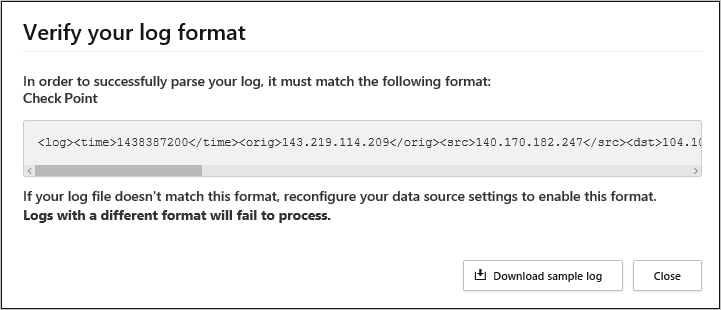

# Cloud Discovery のスナップショット レポートを作成する

[!INCLUDE [Banner for top of topics](includes/banner.md)]

自動ログ コレクターを使用する前に、手動でログをアップロードし、Microsoft Cloud App Security でログ解析することが重要です。 ログ コレクターのしくみと予想されるログ形式の詳細については、「[Cloud Discovery にトラフィック ログを使用する](#log-format)」を参照してください。

まだログがなく、ログがどのように表示されるか例を確認したい場合は、サンプル ログ ファイルをダウンロードしてください。 次の手順に従って、ログがどのように表示されるかを確認してください。

スナップショット レポートを作成するには:

1. 組織のユーザーがインターネット アクセスに使用するファイアウォールとプロキシからログ ファイルを収集します。 組織内のすべてのユーザー アクティビティを示す、トラフィック ピーク時のログを収集するようにしてください。

1. Cloud App Security ポータルで **[探索]** をクリックし、 **[スナップショット レポートの作成]** をクリックします。

    

1. **[レポート名]** と **[説明]** を入力します。

    

1. ログ ファイルのアップロード元にする **[データソース]** を選択します。

1. ダウンロードできるログ サンプルに従ってログが正しく書式設定されているかどうかを確認します。 **[表示して検証]** 、 **[サンプル ログのダウンロード]** の順にクリックします。 自分のログとサンプルを比較し、互換性があることを確認します。

    

    > [!NOTE]
    > FTP サンプル形式はスナップショットと自動アップロードでサポートされています。一方、syslog は自動アップロードでのみサポートされています。  
    サンプル ログのダウンロードを実行すると、サンプル FTP ログがダウンロードされます。

1. アップロードする**トラフィック ログを選択**します。 一度に最大 20 個のファイルをアップロードできます。 圧縮された ZIP 形式のファイルもサポートされます。

1. **[作成]** をクリックします。

1. アップロードが完了すると、ログが正常にアップロードされたことを通知するステータス メッセージが画面右上隅に表示されます。

1. ログ ファイルのアップロード後、ファイルの解析および分析には多少時間がかかります。
    ログ ファイルの処理が完了すると、終了したことを通知する電子メールを受信します。

1. 通知バナーが、**Cloud Discovery ダッシュボード**の上部にあるステータス バーに表示されます。 バナーにより、ログ ファイルの最新の処理状態が通知されます。
    

1. ログが正常にアップロードされると、ログ ファイルの処理が正常に完了したことを知らせる通知が表示されます。 この時点で、ステータス バーのリンクをクリックするか、設定の歯車に移動して **[設定]** を選択することで、レポートを表示できます。

1. 次に、 **[Cloud Discovery]** で **[スナップショット レポート]** を選択し、自分のスナップショット レポートを選びます。

    

## Cloud Discovery にトラフィック ログを使用する 

Cloud Discovery でトラフィック ログのデータを使用します。 ログが詳細になるほど、可視性が向上します。 Cloud Discovery には、次の属性を持つ Web トラフィック データが必要です。

- トランザクションの日付
- ソース IP
- ソース ユーザー - 強く推奨
- 宛先 IP アドレス
- 接続先 URL を**推奨** (URL の方が IP アドレスよりもクラウド アプリの検出の精度が高い)
- データ総量 (データ情報は非常に重要)
- アップロードまたはダウンロードされたデータの量 (クラウド アプリの使用パターンに関する分析情報を提供)
- 実行されたアクション (許可/ブロック)

Cloud Discovery では、ログに含まれていない属性を表示または分析することはできません。
たとえば、**Cisco ASA Firewall** の標準ログ形式には、**トランザクションごとのアップロードされたバイト数**、**ユーザー名**、**ターゲット URL** (ターゲット IP のみ) はありません。
このため、これらの属性はこれらのログの Cloud Discovery データには表示されず、クラウド アプリの可視性が制限されます。 Cisco ASA Firewall の場合は、情報レベルを 6 に設定する必要があります。

Cloud Discovery レポートを正常に生成するには、トラフィック ログが次の条件を満たしている必要があります。

1. [データ ソースがサポートされている](set-up-cloud-discovery.md#supported-firewalls-and-proxies)。
2. ログ形式が、予想される標準形式 (ログ ツールによってアップロードされたときにチェックされる形式) と一致している。
3. イベントが 90 日を経過していない。
4. ログ ファイルが有効で、送信トラフィック情報が含まれている。

## 次のステップ

> [!div class="nextstepaction"]
> [ポリシーによるクラウド アプリの制御](control-cloud-apps-with-policies.md)

[!INCLUDE [Open support ticket](includes/support.md)]
